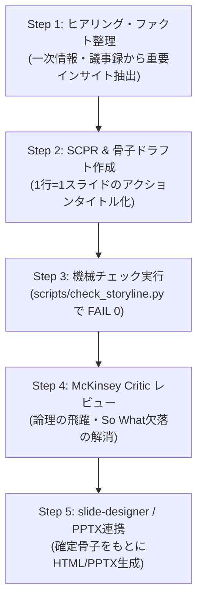

# コンサルティング・ストーリーライン構築スキル（consulting-storyline-skill）

戦略コンサルティングファーム（マッキンゼー、BCG、Bain等）水準の **「ストーリーライン」「エグゼクティブサマリー」「スライド骨子（ゴーストデッキ）」** を設計するための専門スキルです。

美しいスライド（PowerPoint / HTML）を作る前に、**「論理の骨格（ストーリーライン）」** を100%確定させます。スライドタイトル（メッセージライン）だけを通読して全体の主張と提案が完全に伝わる状態を作り、下流工程の `consulting-pptx-skill` に引き渡します。

---

## 1. コア原則（The Golden Rules）

### 原則1: ストーリーライン先行（Storyline-First）
- **いきなりスライド（PPTX/HTML）を開かない・作らない**。
- スライドの成否の8割はストーリーライン（論理展開）で決まります。骨子が固まる前にデザインに入ると、論理の破綻による手戻りが爆発します。
- テキスト（Markdown）で骨子を組み、タイトル通読テスト（Headline-Flow Test）をクリアしてからスライド化します。

### 原則2: アクションタイトル（Action Titles: 体言止め・ラベル病の禁止）
- 各スライドのタイトルは、単なるトピック（名詞）ではなく、**「分析から導かれた結論・主張（メッセージ）」** を完全な文で言い切ります。
- ❌ **禁止（トピックタイトル病）**:
  - 「市場動向について」「現状の課題」「競合分析」「システム構成案」
- ⭕️ **必須（アクションタイトル）**:
  - 「国内市場は年率24%で急成長する一方、自社シェアは競合の価格攻勢により直近1年で5pt低下している」
  - 「属人化と重複入力に起因する年間2.4万時間の過剰工数を、3つの改革レバーにより60%削減可能である」

### 原則3: ピラミッド原則（Answer-First）
1. **Tagline（15秒）**: デッキ全体の提案・核心メッセージ（1文）
2. **Executive Summary（1枚要約）**: 結論＋それを支える2〜4つの柱
3. **Pack（本体スライド）**: 各スライド1主張。メッセージを支える具体的なデータ・図解
4. **Appendix（補足資料）**: 前提試算、詳細データ、補足ロジック（本編では話さない）

### 原則4: Headline-Flow Test（タイトル通読テスト）
- 全スライドのタイトルだけを上から順に並べたとき、**「Aである（現状）→ しかしBが起きた（変化）→ 核心はCである（論点）→ したがってDをすべき（解決策）」** という一筋のストーリーが淀みなく完結していなければなりません。

---

## 2. エグゼクティブサマリーの標準型（SCPR構造）

経営層・意思決定者向けのエグゼクティブサマリは、**SCPR構造**で設計します。

| 要素 | 意味 | 記述内容 |
| :--- | :--- | :--- |
| **S (Situation)** | 安定した現状・前提 | クライアント企業や業界の基礎環境（共通認識） |
| **C (Complication)** | 最近生じた変化・危機 | なぜ今動く必要があるのか（AI台頭、法改正、業績悪化等の触媒） |
| **P (Problem)** | 解くべき核心の問い | 単一で具体的、かつ答えられる戦略的論点（「いかに〜すべきか？」） |
| **R (Recommendation)** | 推奨施策・打ち手 | MECEに整理された2〜3つの柱、定量効果、期限・投資規模 |

---

## 3. スライド骨子の標準フォーマット（consulting-pptx-skill 連動仕様）

ストーリーライン（骨子Markdown）は、以下のフォーマットで出力します。各スライドに `consulting-pptx-skill` の **62型カタログ（型ID）** を指定することで、そのままスライド生成スクリプトに引き渡せます。

```markdown
# [案件名/テーマ] プレゼンテーションストーリーライン

- **Tagline**: [15秒で言うと何か：デッキ全体の核心メッセージ]
- **想定聴衆**: [CEO / 役員会 / 事業本部長 / 現場リーダー]
- **ゴール**: [投資承認 / 提案採択 / スコープ合意 / 方針決定]

---

### [S01] 表紙
- 型ID: b01 (title_page)
- タイトル: [資料タイトル]
- サブタイトル: [サブタイトル / 核心メッセージ]

### [S02] エグゼクティブサマリー
- 型ID: m01 (executive_summary)
- アクションタイトル: [結論を言い切るメッセージ文（25〜50文字）]
- 論拠/柱:
  1. [柱1: 現状と変化（S-C）]
  2. [柱2: 解決策の骨子（R）]
  3. [柱3: 期待効果と投資回収（インパクト）]

### [S03] [セクション名やスライドテーマ]
- 型ID: [62型カタログの型ID: 例 b06, b26, m10 等]
- アクションタイトル: [結論・主張を言い切るアクションタイトル]
- 論拠/ファクト:
  - [主張を支えるデータ・ファクト1]
  - [主張を支えるデータ・ファクト2]
  - [示唆・インサイト]
- 出典: [データソース / 調査元]
```

### 【主要な型ID（使いどころ）】
- `b01`: 表紙 (`title_page`)
- `m01`: エグゼクティブサマリー (`executive_summary`)
- `b06`: 前提→帰結の2カラム (`premise_conclusion`)
- `b26`: 課題と打ち手の対比 (`issue_action_columns`)
- `b05`: 矢羽・プロセス・フェーズ移行 (`chevron_steps`)
- `b09`: 軸のある表・ポジショニング (`axis_table`)
- `b11`: 主張パネル＋図解 (`claim_panel_figure`)
- `m07`: 寄与度ブリッジ・収益増減 (`waterfall`)
- `m10`: 選択肢の比較表 (`comparison_table`)
- `b16`: 進捗バブル行列 (`progress_bubble_matrix`)

*(※全62型の詳細は `references/archetype-catalog.md` または `consulting-pptx-skill` 参照)*

---

## 4. 実行ワークフロー（4ステップ）



1. **Step 1: インプットの論点整理**:
   - 目的（誰に、何を伝え、どう動いてほしいか）を明確化。
   - 一次情報から「事実（Fact）」と「示唆（So What?）」を抽出。
2. **Step 2: テンプレート選定と骨子ドラフト作成**:
   - `references/storyline-templates.md` から最適なストーリー展開（提案、改革、役員報告等）を選択。
   - 各スライドにアクションタイトル、型ID、論拠箇条書きを記述。
3. **Step 3: 機械検証の実行**:
   - `python3 scripts/check_storyline.py <骨子ファイル.md>` を実行。
   - 体言止め、トピックタイトル病、文字数の警告を修正し、**FAIL 0** を達成する。
4. **Step 4: McKinsey Critic による論理ストレステスト**:
   - 各スライドが全体の結論に貢献しているか？
   - 「だから何？（So What?）」に対する答えがあるか？
   - 競合や前提の漏れ（MECE性）がないか？
5. **Step 5: スライド生成への引き渡し**:
   - 確定した骨子（Markdown）をもとに、`consulting-pptx-skill`（または `slide-designer`）がスライドHTMLおよびPPTXを生成。

---

## 5. 機械チェックスクリプト（`check_storyline.py`）

本スキルには、骨子Markdownを自動解析するバリデータが付属しています。

```bash
# 基本実行（エラー FAIL を検出）
python3 scripts/check_storyline.py docs/proposal_storyline.md

# 厳格モード（警告 WARN もエラー扱い）
python3 scripts/check_storyline.py docs/proposal_storyline.md --strict
```

### バリデータの判定基準
- **FAIL**:
  - トピックタイトル（「〜の課題」「〜の概要」「〜について」等の体言止め・名詞ラベル）
  - スライド見出しが検出されない
- **WARN**:
  - タイトルが短すぎる（< 15文字）または長すぎる（> 65文字）
  - 疑問形タイトル（「〜か？」）
  - 型ID（Archetype）の未指定
  - 論拠・ファクトの箇条書きが2件未満
  - 表紙・エグゼクティブサマリの欠落
